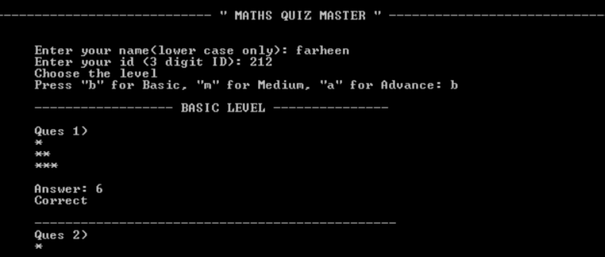

# Maths Quiz Master  

<p align="center">  
   
 <br>  
 <br>  
</p>  

**Maths Quiz Master** is an interactive, command-line-based quiz program developed entirely in assembly language. It challenges users with a variety of math-related questions and tracks their performance, making it both an educational and engaging tool for enhancing mathematical skills.  

---

## Why Maths Quiz Master is Important  

Mathematics plays a vital role in shaping logical and analytical thinking. However, practicing math can sometimes feel monotonous. **Maths Quiz Master** aims to make learning math an enjoyable experience by providing a gamified platform for users to test their skills.  

Additionally, the program is developed in assembly language for the **8086 microprocessor**, demonstrating how low-level programming can be used to build functional applications. This project is also a great learning resource for students and developers exploring system-level programming concepts.  

---

## Features  

- **Interactive Quiz**: The program engages users by presenting a series of math questions in a fun and interactive way.  
- **Wide Question Variety**: Covers topics like arithmetic operations (addition, subtraction, multiplication, and division).  
- **Dynamic Difficulty**: Questions are generated to provide challenges suitable for beginners and intermediate learners.  
- **Score Tracking**: At the end of the quiz, the program displays the user’s score, providing feedback on their performance.  
- **User-Friendly Console Interface**: Clear instructions and prompts guide users through the quiz seamlessly.  

---

## Technologies Used  

- **Assembly Language**: The program is written in x86 assembly language, specifically designed for the **8086 microprocessor**.  
- **TASM/MASM Assembler**: The program is assembled and linked using tools like **TASM** or **MASM**, which convert the assembly code into executable machine code.  
- **DOSBox Emulator**: To run the program on modern systems, it can be executed in an emulator like **DOSBox**, simulating an 8086 environment.  

---

## Utilization of Assembly Language  

The **Maths Quiz Master** demonstrates the application of low-level programming by utilizing:  

- **Registers** for data manipulation and processing.  
- **Interrupts** for screen display and input/output handling.  
- **Stack Operations** to store and retrieve values during program execution.  
- **Looping Constructs** for repetitive tasks like question generation and score calculation.  

This project exemplifies how the 8086 microprocessor's architecture and assembly language can be utilized to create a functional educational application.  

---

## Accuracy and Limitations  

While **Maths Quiz Master** is designed to deliver accurate results and an interactive experience, it has the following limitations:  

- **Input Constraints**: Users must follow specific input formats as the program cannot handle invalid or non-numeric inputs.  
- **Limited Scalability**: Being a command-line-based tool, it may lack advanced features found in graphical quiz applications.  
- **Platform Dependence**: The program is designed for the 8086 architecture and may require an emulator like **DOSBox** to run on modern systems.  

---

## Disclaimer  

**Maths Quiz Master** is intended for educational purposes only. It is a demonstration of assembly language programming for system-level applications and is not designed for advanced mathematical training or professional use.  

---

## Installation  

1. **Download the Code**: Clone or download the project repository to your local system.  

2. **Assemble the Program**: Use an assembler like **TASM** or **MASM** to compile the code:  
   ```bash  
   tasm mathsquiz.asm  
   ```  
   ```bash  
   tlink mathsquiz.obj  
   ```  

3. **Run the Program**: Execute the compiled file in an environment supporting the 8086 architecture, such as **DOSBox**:  
   ```bash  
   mathsquiz.exe  
   ```  

4. **Start the Quiz**: Follow the on-screen instructions to begin the quiz.  

---

## Usage  

- Launch the program by running the executable file.  
- The program will prompt you to answer a series of math questions.  
- Input your answers directly in the console.  
- At the end of the quiz, view your total score and feedback.  
- Restart the program to attempt another quiz session.  

---

## Contact Information  

If you have any questions, suggestions, or feedback regarding the **Maths Quiz Master** project, feel free to reach out:  

- **Name**: Farheen Imam  
- **Email**: [farheenimam.offically@gmail.com](mailto:farheenimam.offically@gmail.com)  
- **GitHub**: [https://github.com/farheenimam](https://github.com/farheenimam)  
- **LinkedIn**: [https://www.linkedin.com/in/farheen-imam-686356280/](https://www.linkedin.com/in/farheen-imam-686356280/)  
